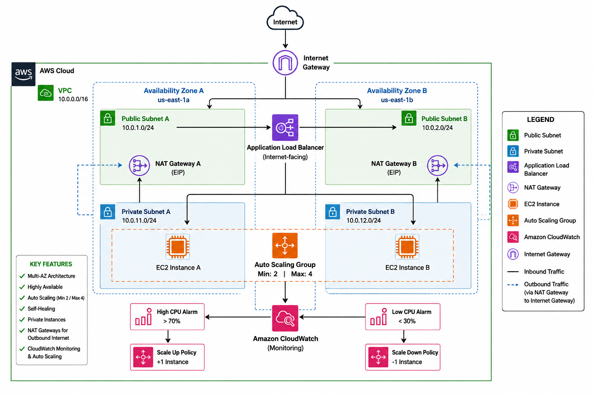

# Terraform Production Infrastructure on AWS

A production-style AWS infrastructure project built with Terraform using a modular architecture.

This project deploys a highly available and scalable web application infrastructure across multiple Availability Zones. It includes public and private networking, an Application Load Balancer, Auto Scaling, CloudWatch monitoring, security groups, NAT gateways, and automated EC2 bootstrapping.

## Architecture Overview

The infrastructure is deployed across two Availability Zones in the `us-east-1` region.

Internet traffic enters through an internet-facing Application Load Balancer deployed across public subnets. The ALB forwards traffic to EC2 instances running NGINX inside private subnets.

The EC2 instances are managed by an Auto Scaling Group with a minimum capacity of 2 and maximum capacity of 4 instances.

Private instances access the internet through NAT Gateways while remaining inaccessible directly from the public internet.

CloudWatch monitors CPU utilization and triggers scaling policies when utilization crosses configured thresholds.

## Architecture



Outbound traffic:

Private Subnet A -> NAT Gateway A -> Internet Gateway
Private Subnet B -> NAT Gateway B -> Internet Gateway

## Project Structure

```text
terraform-production-infrastructure/
├── README.md
├── main.tf
├── outputs.tf
├── provider.tf
├── variables.tf
├── versions.tf
├── scripts/
│   └── install.sh
└── modules/
    ├── alb/
    │   ├── main.tf
    │   ├── outputs.tf
    │   └── variables.tf
    ├── compute/
    │   ├── main.tf
    │   ├── outputs.tf
    │   └── variables.tf
    ├── monitoring/
    │   ├── main.tf
    │   ├── outputs.tf
    │   └── variables.tf
    ├── networking/
    │   ├── main.tf
    │   ├── outputs.tf
    │   └── variables.tf
    └── security/
        ├── main.tf
        ├── outputs.tf
        └── variables.tf
```

The infrastructure is separated into reusable Terraform modules to keep each layer of the architecture organized and independently maintainable.

## Terraform Modules

### Networking

The networking module creates the foundation of the AWS environment, including:

- VPC
- Two public subnets across separate Availability Zones
- Two private subnets across separate Availability Zones
- Internet Gateway
- Two NAT Gateways
- Elastic IP addresses
- Public route table
- Separate private route tables
- Route table associations

Each private subnet routes outbound internet traffic through a NAT Gateway in its respective Availability Zone.

### Security

The security module creates separate security groups for the Application Load Balancer and application servers.

The ALB security group permits inbound HTTP and HTTPS traffic. The current application listener uses HTTP on port 80.

The EC2 security group only allows application traffic from the ALB security group, preventing direct inbound internet access to the application servers.

### Compute

The compute module manages the application compute layer, including:

- Amazon Linux AMI discovery using an AWS data source
- EC2 Launch Template
- Auto Scaling Group
- Automated NGINX installation through EC2 user data

Application instances are deployed into private subnets across two Availability Zones.

The Auto Scaling Group maintains a minimum and desired capacity of 2 instances with a maximum capacity of 4.

### Load Balancing

The ALB module creates:

- Internet-facing Application Load Balancer
- Target Group
- HTTP Listener
- Target health checks

The Application Load Balancer receives public traffic and forwards requests to healthy EC2 instances running in the private subnets.

### Monitoring

The monitoring module provides CloudWatch-based monitoring and automatic scaling.

The project includes:

- High CPU CloudWatch alarm
- Low CPU CloudWatch alarm
- Scale-up policy
- Scale-down policy

When average CPU utilization exceeds 70%, the scale-up policy increases capacity by one instance.

When average CPU utilization falls below 30%, the scale-down policy decreases capacity by one instance while respecting the Auto Scaling Group minimum capacity.

## Testing and Validation

The infrastructure was tested beyond a successful Terraform deployment to validate availability, self-healing, load balancing, and automatic scaling behavior.

### Load Balancer Validation

After deployment, the Application Load Balancer DNS endpoint was tested from a web browser.

The request successfully traveled through the complete application path:

```text
Internet
   |
   v
Application Load Balancer
   |
   v
Target Group
   |
   v
Private EC2 Instances
   |
   v
NGINX
```

Both EC2 instances registered with the target group and reported a `Healthy` status.

The application successfully returned the NGINX page:

```text
Hello from Terraform Production Infrastructure
```

### Self-Healing Test

To validate fault recovery, one EC2 instance managed by the Auto Scaling Group was manually terminated.

The Auto Scaling Group detected that capacity had fallen below the configured desired capacity and automatically launched a replacement instance.

The replacement instance:

1. Launched in a configured private subnet.
2. Executed the bootstrap script.
3. Installed and started NGINX.
4. Registered with the Application Load Balancer target group.
5. Passed the configured health checks.
6. Reached a `Healthy` target state.

No manual instance provisioning was required.

This demonstrated that the application compute layer can automatically recover from an individual EC2 instance failure.

### Auto Scaling Test

Automatic scaling was tested by temporarily lowering the high CPU CloudWatch alarm threshold.

This triggered the following workflow:

```text
CPU threshold exceeded
        |
        v
CloudWatch Alarm
        |
        v
Scale-Up Policy
        |
        v
Auto Scaling Group
        |
        v
Additional EC2 Capacity
```

The Auto Scaling Group successfully increased capacity from 2 instances up to its configured maximum of 4 instances.

After testing, the high CPU threshold was restored to its normal value of 70%.

The infrastructure was then returned to its normal baseline configuration.

### Terraform State Validation

After infrastructure changes and testing, the configuration was validated using:

```bash
terraform fmt -recursive
terraform validate
terraform plan
```

A clean environment returns:

```text
No changes. Your infrastructure matches the configuration.
```

The Auto Scaling Group lifecycle configuration also ignores runtime changes to `desired_capacity`, allowing AWS Auto Scaling policies to manage application capacity without Terraform attempting to overwrite normal scaling activity.

## High Availability Design

The infrastructure uses two Availability Zones to reduce dependency on a single AWS failure domain.

Application resources are distributed across:

- `us-east-1a`
- `us-east-1b`

Each Availability Zone contains a public and private subnet.

The Application Load Balancer spans both public subnets, while EC2 application instances are launched across the private subnets.

Each private subnet also uses a NAT Gateway in its respective Availability Zone for outbound internet connectivity.

This design allows the application tier to continue operating if an individual application instance fails and provides infrastructure across multiple Availability Zones.

## Security Design

The application servers are not directly exposed to the public internet.

Public traffic follows this path:

```text
Internet
   |
   v
ALB Security Group
   |
   | HTTP :80
   v
Application Load Balancer
   |
   v
EC2 Security Group
   |
   | Traffic allowed from ALB
   v
Private EC2 Instances
```

EC2 instances do not require public IPv4 addresses. Outbound internet connectivity for package installation and updates is provided through NAT Gateways.

This separates the public entry point from the private application tier and limits direct access to the EC2 instances.

## Prerequisites

Before deploying this infrastructure, ensure the following tools are installed and configured:

- Terraform
- AWS CLI
- Git
- An AWS account with permissions to create the required resources

Verify your AWS CLI configuration:

```bash
aws sts get-caller-identity
```

Verify Terraform:

```bash
terraform version
```

## Deployment

### 1. Clone the Repository

```bash
git clone <repository-url>
cd terraform-production-infrastructure
```

### 2. Configure Terraform Variables

Create a local `terraform.tfvars` file.

Example:

```hcl
project_name  = "terraform-production-infrastructure"
environment   = "dev"
instance_type = "t3.micro"

vpc_cidr = "10.0.0.0/16"

public_subnet_a_cidr  = "10.0.1.0/24"
public_subnet_b_cidr  = "10.0.2.0/24"
private_subnet_a_cidr = "10.0.11.0/24"
private_subnet_b_cidr = "10.0.12.0/24"
```

> `terraform.tfvars` is excluded from version control through `.gitignore`.

### 3. Initialize Terraform

```bash
terraform init
```

### 4. Format and Validate

```bash
terraform fmt -recursive
terraform validate
```

### 5. Review the Execution Plan

```bash
terraform plan
```

Always review the plan before applying infrastructure changes.

### 6. Deploy

```bash
terraform apply
```

Review the proposed changes and enter `yes` when prompted.

### 7. View Outputs

After deployment:

```bash
terraform output
```

The Application Load Balancer DNS endpoint can be retrieved with:

```bash
terraform output -raw alb_dns_name
```

Open the ALB DNS endpoint in a browser to verify the application.

## Destroying the Infrastructure

This project creates AWS resources that can incur charges, including NAT Gateways, Application Load Balancers, and EC2 instances.

When the environment is no longer needed:

```bash
terraform plan -destroy
terraform destroy
```

Review the resources carefully before confirming the destroy operation.

## Key Design Decisions

### Private Application Servers

EC2 instances are deployed into private subnets without direct public internet exposure. The Application Load Balancer serves as the public entry point.

### Multi-AZ Architecture

Resources are distributed across two Availability Zones to improve availability and reduce reliance on a single failure domain.

### Highly Available NAT Architecture

Each private subnet uses a NAT Gateway located in the corresponding Availability Zone, avoiding reliance on a single NAT Gateway for outbound connectivity.

### Dynamic AMI Discovery

The compute module uses an AWS AMI data source rather than permanently hardcoding an AMI ID.

### Modular Terraform

Networking, security, compute, load balancing, and monitoring are separated into Terraform modules to improve organization and maintainability.

### External Bootstrap Script

EC2 bootstrapping is stored in:

```text
scripts/install.sh
```

The Launch Template loads the script as user data. This keeps operating-system configuration separate from the Terraform resource definition.

### Runtime Auto Scaling

CloudWatch alarms trigger Auto Scaling policies based on CPU utilization.

Terraform ignores runtime changes to the Auto Scaling Group's `desired_capacity`, allowing AWS Auto Scaling to control capacity after deployment while Terraform continues managing the minimum, maximum, Launch Template, networking, and other infrastructure configuration.

## Skills Demonstrated

This project demonstrates hands-on experience with:

- Terraform Infrastructure as Code
- Terraform modules, variables, outputs, locals, and lifecycle rules
- AWS VPC networking
- Public and private subnet design
- Multi-AZ architecture
- Internet Gateways and NAT Gateways
- Route tables and routing
- EC2 Launch Templates
- EC2 Auto Scaling
- Application Load Balancers
- Target groups and health checks
- AWS Security Groups
- Amazon CloudWatch alarms
- Automatic scaling policies
- Linux bootstrapping with Bash
- Infrastructure testing and fault recovery
- Git and GitHub version control

## Lessons Learned

Building this project provided practical experience designing infrastructure as a connected system rather than as individual AWS resources.

Key lessons included:

- How public and private subnet routing differs.
- Why private EC2 instances use NAT Gateways for outbound internet access.
- How security groups can reference other security groups to restrict application traffic.
- How an ALB distributes traffic to healthy targets.
- How an Auto Scaling Group replaces failed instances automatically.
- How CloudWatch alarms can trigger scaling actions.
- How Terraform modules communicate through variables and outputs.
- How Terraform state differs from runtime infrastructure behavior.
- Why some dynamically managed attributes, such as Auto Scaling desired capacity, may require lifecycle considerations.
- How to test infrastructure behavior rather than relying only on a successful Terraform deployment.